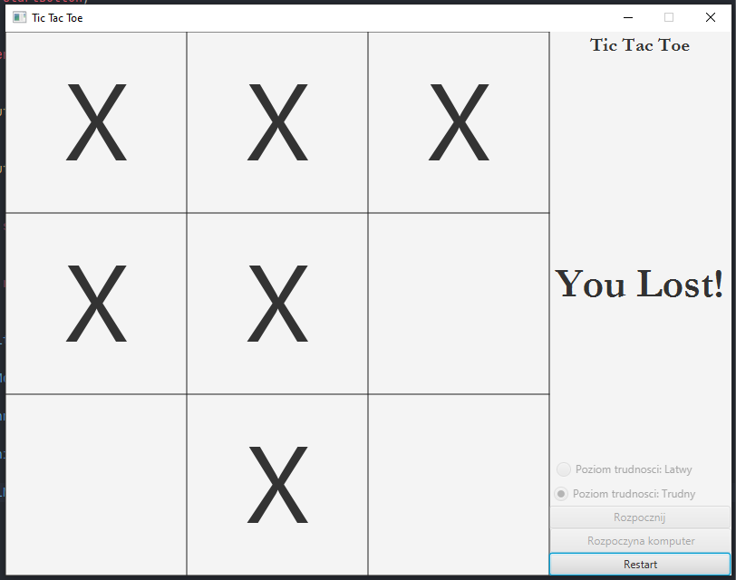

# AI Tic Tac Toe
> Different version of well known game implemented with AI

## Table of contents
* [General info](#general-info)
* [Screenshots](#screenshots)
* [Setup](#setup)
* [Code Examples](#code-examples)
* [Tech/framework used](#techframework-used)
* [Status](#status)
* [Contact](#contact)
* [License](#license)

## General info
>It is different version of Tic Tac Toe game where game ends when player put third X in a row.
> The game have 2 difficulty level and was implemented with MiniMax alghoritm

## Screenshots

## Setup

>Just pull my code to your PC :smile:

## Code Examples
Show examples of usage:

    public int miniMax(int difficultyLvL,boolean AI, Integer[][] posTable, int movesToBeDone){
        int winnerCheck = winningCheck(posTable,AI);
        if (winnerCheck != 0) return winnerCheck;

        if (AI) {//AI
            int bestRate = Integer.MIN_VALUE;
            for (int x = 0; x < 3; x++) {
                for (int y = 0; y < 3; y++) {
                    if (posTable[x][y] == 0){
                        posTable[x][y] = -1;
                        int rate = miniMax(difficultyLvL,false,posTable, movesToBeDone + 1);
                        rate = rate - movesToBeDone;
                        posTable[x][y] = 0;
                        if (difficultyLvL == 2) { if (rate > bestRate) bestRate = rate; } else {if (rate < bestRate) bestRate = rate;}
                    }
                }
            }
            return bestRate;
        }else {//symulacja gracza
            int bestRate = Integer.MAX_VALUE;
            for (int x = 0; x < 3; x++) {
                for (int y = 0; y < 3; y++) {
                    if (posTable[x][y] == 0){
                        posTable[x][y] = 1;
                        int rate = miniMax(difficultyLvL,true,posTable, movesToBeDone + 1);
                        posTable[x][y] = 0;
                        rate = rate + movesToBeDone;
                        if (difficultyLvL == 2) { if (rate < bestRate) bestRate = rate; } else {if (rate > bestRate) bestRate = rate;}
                    }
                }
            }
            return bestRate;
        }
    }

## Tech/framework used

* Java 16
* JavaFX

## Status
Project is: _finished_ :monocle_face:

## Contact
Created by [@Bartosz Koscielniak](https://github.com/BartoszKoscielniak) - feel free to contact me! :+1:

## License
[MIT](https://choosealicense.com/licenses/mit/) ©

